# Three.js Playground

A collection of small real-time graphics experiments built with
[Three.js](https://threejs.org/) and TypeScript. Pick an app from the panel in
the top-right corner and tweak its parameters live.

**▶ Live demo: <https://dankane2029.github.io/three-js-playground/>**

**Stack:** Three.js · TypeScript · [Vite](https://vite.dev/) ·
[Tweakpane](https://tweakpane.github.io/docs/) · ESLint 9 · Prettier 3.

## Getting started

Install [Node.js](https://nodejs.org/) and npm, then:

```bash
npm install       # install dependencies
npm run dev       # start the dev server with hot reload
npm run build     # type-check and produce a production build in dist/
npm run preview   # serve the production build locally
npm run lint      # lint with ESLint
npm run format    # format with Prettier
```

The app is deployed to GitHub Pages at
<https://dankane2029.github.io/three-js-playground/> — every push to `main`
rebuilds and republishes it via `.github/workflows/deploy.yml`.

## Architecture

Each experiment is an [`App`](src/core/App.ts) subclass that owns its own scene
and camera and implements the lifecycle hooks it needs (`setup`, `update`,
`resize`, `render`, `dispose`) plus optional pointer/wheel handlers. The
[`Playground`](src/core/Playground.ts) orchestrator owns the renderer and render
loop, handles resizing and pointer routing, and switches between apps. Controls
are declared per app by binding a `params` object to a Tweakpane folder in
`setupControls`, and each app disposes its GPU resources on teardown.

### Scaffolding new apps

`npm run generate-code` runs the [Plop](https://plopjs.com/) generators to
scaffold a new app (registered automatically in `src/main.ts`) or shader from the
templates in `code-generators/`.

## The apps

Each app has an educational deep-dive — the concepts and math behind it — in
[`docs/apps/`](docs/apps/).

### Groovy Texture

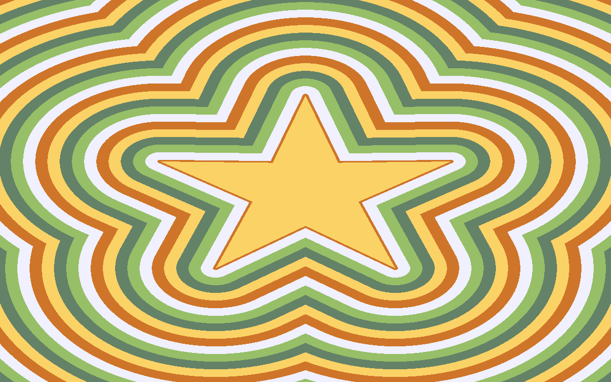

A vibrant 1970s-inspired five-pointed star. A fragment shader uses a signed
distance function to draw color bands moving inward. The five colors, wave speed,
and star size are all adjustable.

### Mandelbrot Set

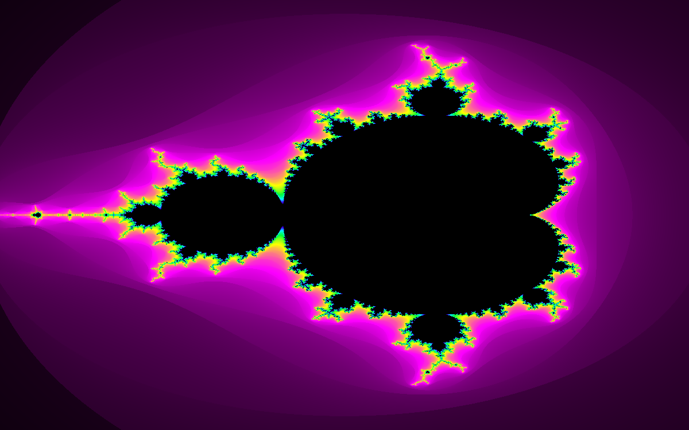

The famous fractal, computed in a fragment shader by iterating
$Z_{n+1}=Z_n^2+C$ and coloring each pixel by how quickly the sequence escapes.
Drag to pan and scroll to zoom; the five gradient colors and iteration count are
adjustable.

### Planet Generator

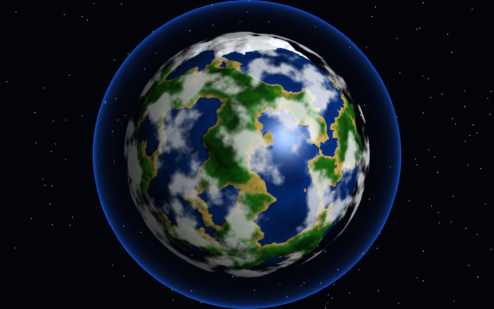

A procedural mini planet. Seamless 3D simplex-noise FBM (sampled on the sphere,
so there's no UV seam or pole pinching) displaces the surface in the vertex
shader, flattening everything below sea level into a smooth ocean. The fragment
shader re-evaluates elevation per pixel for smooth coastlines, colors the surface
by elevation biome (deep ocean → shallow water → beach → grass → forest → rock →
snow, with polar ice caps), and lights it with a sun direction plus specular
water. A fresnel atmosphere glow, a drifting cloud layer, and a starfield
complete the scene. Drag to orbit and scroll to zoom. Controls include planet
presets (Earth-like, Desert, Ice, Lava, Alien), a seed regenerator, and sea
level, amplitude, frequency, octaves, atmosphere, clouds, and biome colors.

### Bloom Field

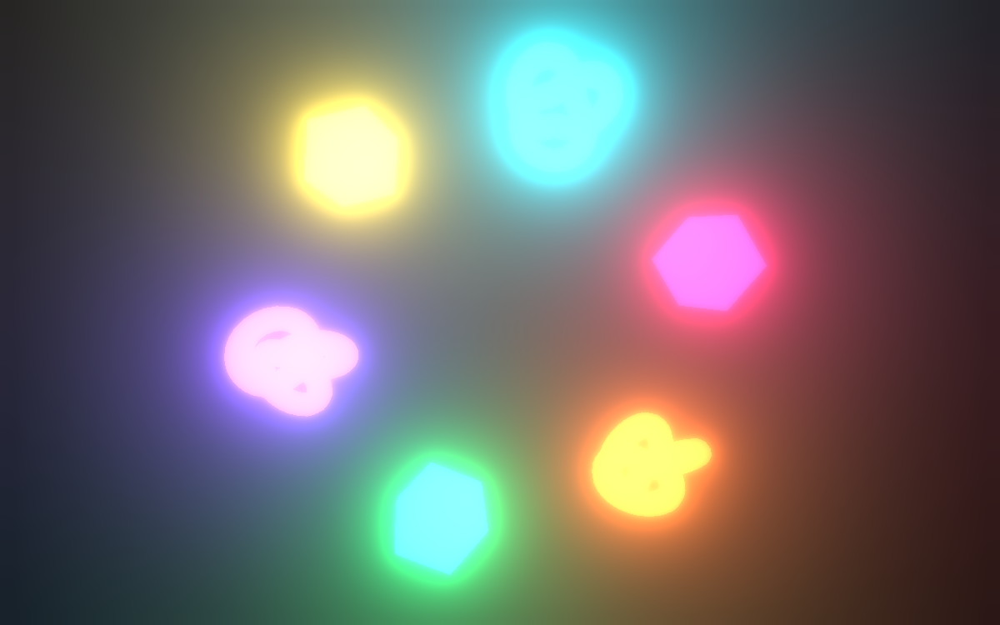

A ring of emissive shapes rendered through an `EffectComposer` pipeline with an
`UnrealBloomPass`. Adjust the bloom strength, radius, and threshold.

### Particle Flow

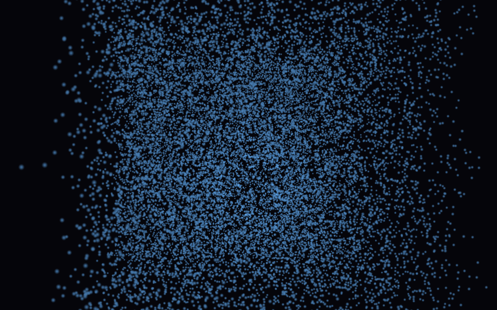

A GPU-driven particle field: every particle's animated position is computed in
the vertex shader from its seed and time, plus a repulsion from the pointer. Move
the pointer to push the swarm around; tune count, speed, swirl, size, pointer
strength, and color.

### PBR Viewer

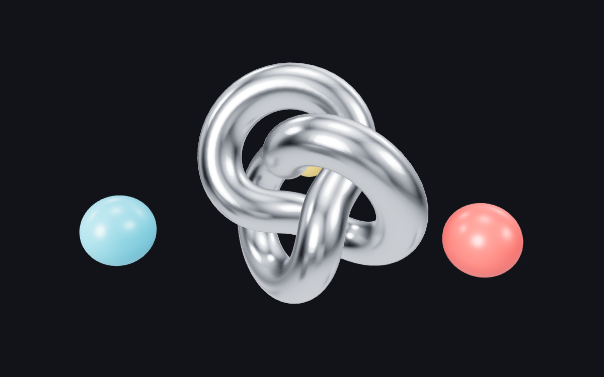

A physically based scene lit by image-based lighting (`RoomEnvironment` via
`PMREMGenerator`) with orbit controls. Adjust metalness, roughness, environment
intensity, and auto-rotation.

### Pixelate

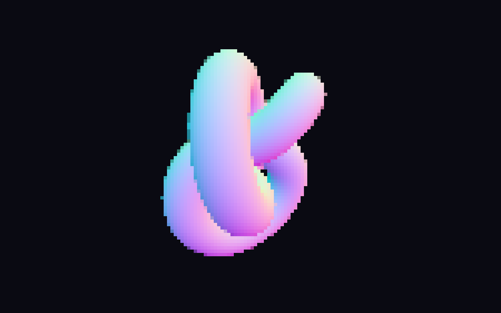

A spinning shape run through a custom pixelate post-process shader (a `ShaderPass`
that snaps output pixels to a grid). Adjust the pixel size.

### Raymarch SDF

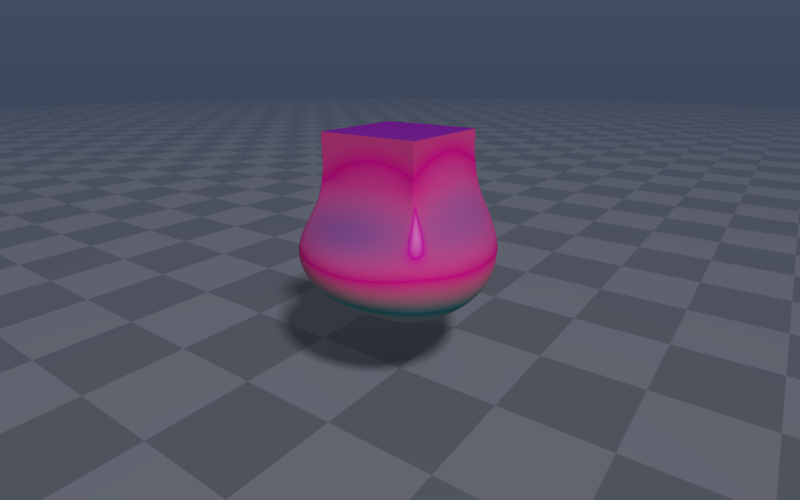

A fullscreen raymarched signed-distance-field scene: three animated primitives
fused with a smooth minimum, on a checkered floor with soft shadows, ambient
occlusion, and fog. Drag to orbit. Adjust animation speed, blend amount, an
optional infinite domain repetition, fog, and the two-color palette.

### Mandelbulb

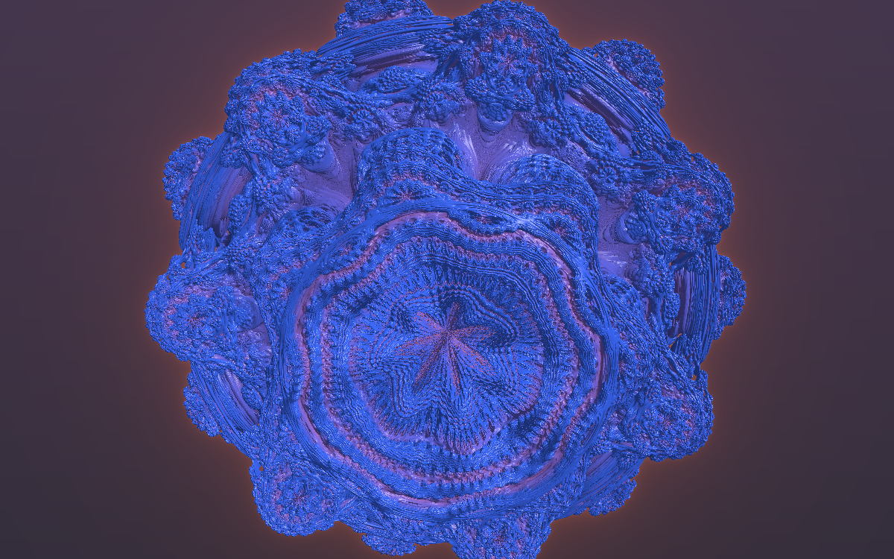

A fullscreen raymarched Mandelbulb — the 3D analogue of the Mandelbrot set —
using the classic distance estimator with orbit-trap coloring and a glow halo.
Drag to orbit and scroll to zoom. Adjust the power (optionally animated),
iteration count, glow, and colors.

### Fluid

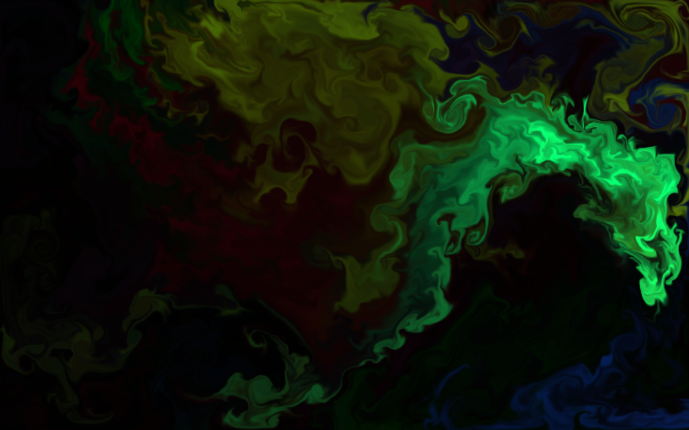

A real-time GPU fluid simulation: a grid-based Navier–Stokes solver (Jos Stam's
"stable fluids") that ping-pongs velocity, dye, and pressure through
floating-point render targets, with semi-Lagrangian advection, vorticity
confinement, and a Jacobi pressure solve. Drag to stir dye through the flow.
Adjust curl, dissipation, pressure iterations, and splat radius.

### Ocean

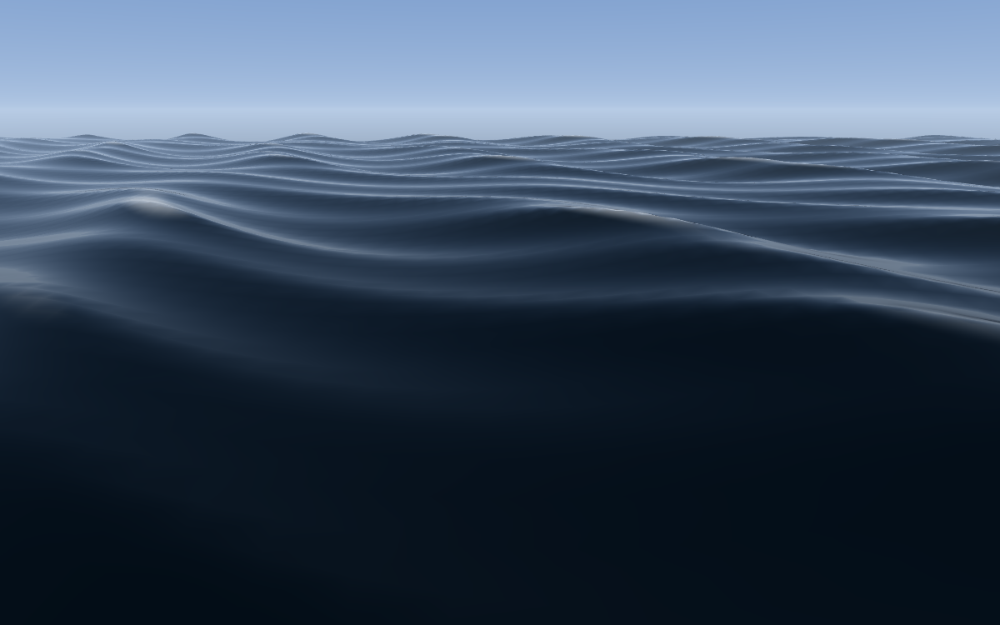

A 3D ocean of Gerstner (trochoidal) waves displaced in the vertex shader, with
analytic normals, a Fresnel blend between deep water and a reflected procedural
sky, specular sun glitter, foam on the crests, and realistic wave dispersion.
Drag to orbit. Adjust amplitude, wavelength, choppiness, wind direction, speed,
foam, water color, and the sun's position.
